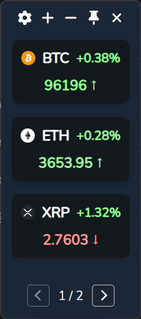

# Crypto Monitor

A simple cross-platform crypto monitor that monitors the price of crypto currencies.

*This project is under development.*

## Features

- Cross-platform: Windows, macOS, Linux
- Real-time crypto price monitoring
- Obtain crypto price data from OKX(currently!)

## Usage

1. Download the latest release from the [Releases](https://github.com/shiquda/crypto-monitor/releases) page.
2. There are four buttons on the top:
    - `+`: Edit the crypto currency to monitor
    - `-`: Minimize the window
    - `📍`: Keep the window on top
    - `❌`: Close the window
3. Double click the crypto currency item to open the *okx* page of the crypto currency in your default browser.

## TODO

- [ ] Settings page
- [ ] More price data sources, e.g. Binance

## Credits

- [wails](https://wails.io/)
- [go-okx](https://github.com/iaping/go-okx)
